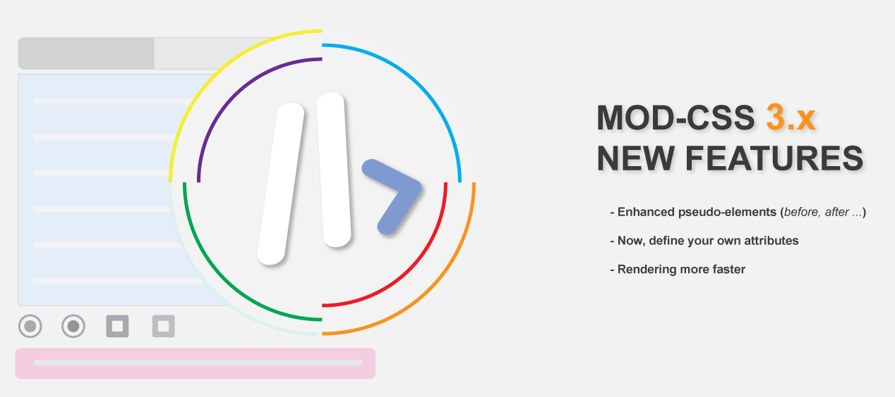

[](https://mod-css.com)

[](https://mod-css.com/)
[](https://codepen.io/mod-css/)
[](https://youtube.com/mod-css)
[](https://mod-css.com/demo)
[]()
[]()

MOD-CSS is a free utility CSS framework for front-end development. It's can be used to design web page or any website.

We support setting of Selector, breakpoints, flexgrid, states, any CSS properties.It's very lightweight (only 10k), single file and only built with javascript.

> ### Our inspiration :heart:

> We want to go fast when you prototype or build a webpage from scratch.
> We don't switch between template and stylesheet while creation processing.
> Sometimes, we must to use arbitrary value because predefined classes don't macth with our needs.
> We want to extends our possibilities/design when we use ready-to-use Bootstrap, Bulma or Materialze components.

## Installation

Only add CDN to an a script tag and let's go !

```html
<head>
    <script src="https://cdn.jsdelivr.net/gh/modsLabs/MOD-CSS-3.x@main/Mod-3.x.min.js">
</head>
```

## How to use it

1. MOD-CSS uses custom properties to call original css properties. These are abbreviated and named intuitively.
   To set a properties, call his equivalent MOD abbreviation followed by its value in square brackets.

```css
w[10px]                 /* ==> width: 10px */
co[blue]                /* ==> color: blue */
p[var(--px)]            /* ==> padding: var(--px) */
```

2. We use custom attributes which start with ***:*** , main attributes are ***:mod*** and ***:box*** .

```html
<div :mod="col[100px]"><div>   <!-- Use :mod to set only flexgrid props-->
<div :box="w[100px] p[9px] fo.sz[10px] co[#f4f4f4]"><div>    <!-- Use :box all properties -->
<div :box="trn[all .3s ease] && hover: m.lf[6px]"><div>   
<div :var=".rdx:checked +label{co[#7d33ff !important]}"><div>    <!-- Use for selectors -->
```
### NEW FEATURE
> In our new version, you can define own attributes to improve compatibility with others frameworks JS based.

```javascript
<script>
   ModCSS.attributes({
     grid: 'mod',
     props: 'xyz',
     var: 'let',
    })
</script>
```

```html
   <div mod="row[100%]">
       <div xyz="col$[5rem] co[orange]">5rem</div>
       <div mod="col[25%]">25%</div>
   </div>

   <div let=".col{ col$[auto] h[10px] }">auto</div>
```

3. Cheatsheet and almost supported properties can be found [here](https://mod-css.com/documentation/cheatsheet/#Cheatsheet)

---

<h2 style="margin-bottom:10px">Summary </h2>

* [1. Define quickly any selector](#sel)
* [2. Standards breakpoints for reponsiveness](#brkp)
* [3. Fully customizable Flexgrid](#flex)
* [4. Set Pseudos on any component](#sta)
* [5. Call any style](#prop)
* [6. Tips](#multi)

### Selector

<div id="sel"><div>
In MOD-CSS, you can quickly define any selector(s) directly in your template by using our custom styles,  
like below :

*1. With single tag*

```html
<div :var="pre { w[100%] wsp[pre-line] }"></div>
```

```css
/*CSS equivalent*/
pre { 
    width:100%; 
    white-space:pre-line; 
    }
```

*2. With an id*

```html
<div :var="#dialog { h[100px] w[100vw] bg[#10101020] }"></div>  
```

```css
/*CSS equivalent*/
#dialog { 
    height:100px; 
    width:100vw; 
    background:#10101020; 
    }
```

*3. With class*

```html
<div :var=".link { bg.co[#f8f8f850] m[1px 0px] p[4px 3px] br[3px] && hover:bg.co[#f8f8f8] }"></div>
```

```css
/*CSS equivalent*/
.link { 
    background-color:#f8f8f850; 
    margin: 1px 0px;
    padding: 4px 3px;
    border-radius: 3px;
    }
.link:hover { 
    background-color:#f8f8f8; 
    }
```

*4. Mixed types*

```html
<div :var="pre, #dialog, .link:hover, [data-id='4'] { bg[white] bd[.25px solid #eee] p[4px 3px] fo.sz[13px] fo.wg[600] }"></div>
```

```css
/*CSS equivalent*/
.pre, #dialog, .link:hover, [data-id='4'] { 
    background: white; 
    border: 0.25px solid #eee;
    padding: 4px 3px;
    font-size: 13px;
    font-weight: 600;
    }
```
### NEW FEATURE
*5. (New) Define with our grid properties*

```html
<!-- Define custom row selector -->
<div :var=".row-100 { row$[100%] tx.al[center] fo.sz[13px] fo.wg[600] }"></div>
```

```css
/*CSS equivalent*/
.row-100 { 
    width: 100%;
    display: inline-flex; 
    flex-direction: row; 
    flex-wrap: wrap;
    text-align: center;
    font-size: 13px;
    font-weight: 600;
   }
```

---

### Breakpoints

<div id="brkp"><div> 
We have a breakpoint management feature that allows you to create specific styles for different screen sizes.  
So, you can easily adapt your design for smartphone, tablet, laptop and more...  
We support six breakpoints :


| breakpoints |            size            |
| :---------: | :------------------------: |
|     xs     |   Extra small < 575.98px   |
|     sm     |       Small ≥ 576px       |
|     md     |      Medium ≥ 768px      |
|     lg     |       Large ≥ 992px       |
|     xl     |   Extra Large ≥ 1200px   |
|     xxl     | Very Extra Large ≥ 1400px |

For calling, use [breakpoint] followed by **?** .
Ex: *md?* , *lg?*

#### Practice

> Noticed, when you don't set a breakpoint, value works on any screen.
> It is on this principle that we will define the others breakpoints while maintaining a default behavior.

*a. We've set default values and added a custom width on medium screen.*

```html
<div :box="w[100%] p[6px] || md? w[80%]"></div>
```

```css
/*CSS equivalent*/
div { 
    width: 100%;
    padding: 6px;
    }
@media only screen and (min-width: 768px) {
    div { 
        width: 100%;
        padding: 6px;
    }
}
```

*b. You can use many breakpoints in same time and many more combinaisons...*

```html
<div :box="md? hover: w[80%] || lg? hover: w[76%] || xxl? w[72%]"></div>
```

```css
/*CSS equivalent*/
div { 
    width: 100%;
    padding: 6px;
    }
@media only screen and (min-width: 768px) {
    div:hover { 
        width: 80%;
    }
@media only screen and (min-width: 992px) {
    div:hover { 
        width: 76%;
    }
@media only screen and (min-width: 1400px) {
    div { 
        width: 72%;
    }
}
```

[Read more >](https://mod-css.com/documentation/breakpoints/)

---

### Flexgrid
<div id="flex"><div> 

MOD features a revolutionary n-columns grid system that allows you to create flexible and responsive with n size.
It support natively automatique sizing, fit-content, precise sizing, gap and offseting.
You can use any css unit to set them, call many flexbox properties to align, evenly distribute and precisely manage element dimensions.

#### Practice

*a. Set a basic grid with a container, one row and two columns*

```html
<div :mod="container[95%]">
    <div :mod="row[100%]">
        <div :mod="col[45%]"></div>
        <div :mod="col[55%]"></div>
    </div>
</div>
```

### NEW FEATURE
*b. **(New)** Define Grid with others attributes*

> In this case, add  '$'  sign

```html
<div :box="container$[95%]">
    <div :box="row$[100%]">
        <div :box="col$[45%]"></div>
        <div :box="col$[auto]"></div>
    </div>
</div>
```

*c. Grid with auto sizing columns*

> Noticed
> **Auto** values try to get all remaining space

```html
<div :mod="container[95%]">
    <div :mod="row[100%]">
        <div :mod="col[auto]"></div>
        <div :mod="col[auto]"></div>
    </div>
</div>
```

*d Grid with fit content*

> Noticed
> **fit** values try to limit the width to the space used by its content.
> It's also can be used on row (to respect design system prerequisite, don't use).

```html
<div :mod="container[95%]">
    <div :mod="row[100%]">
        <div :mod="col[fit]"></div>
        <div :mod="col[auto]"></div>
    </div>
</div>
```

*e. grid with custom units, one row and three columns*

> Noticed
> **Arbitray values** define the real size of these elements.
> For best layout, use them sparingly because in most cases percentage values gives better responsive design.

```html
<div :mod="container[100vmax]">
    <div :mod="row[100%]">
        <div :mod="col[100px]"></div>
        <div :mod="col[55%]"></div>
        <div :mod="col[auto]"></div>
    </div>
</div>
```

*f. Grid with gap between columns*

> Noticed
> You can defined gap with any css units. If you work with percentages, use gap in percentage to avoid ugly layout.
> Gap take a part in total row size, keep in mind this before you set size of columns to avoid overflowing.
> Gap can be set on X and Y in once, Y only or X only.

```html
<!--same value on X and Y-->
<div :mod="row[100% 1%]">
    <div :mod="col[48%]"></div>
    <div :mod="col[48%]"></div>
</div>
```

```html
<!--different values - X: 2% and Y: 1%-->
<div :mod="row[100% 2% 10px]">
    <div :mod="col[100px]"></div>
    <div :mod="col[auto]"></div>
</div>
```

*g. Grid with offset in columns*

> Noticed
> You can defined offset with any css units.
> Offset is a left-margin and take a part in total row size.
> Offseting can also be used to simulate a gap between columns (if you don't want to use regular gap)

```html
<!--We define offseting 25px on both columns-->
<div :mod="row[100%]">
    <div :mod="col[25% 25px]"></div>
    <div :mod="col[auto 25px]"></div>
</div>
```

*h. Grid columns with centered content*

> Noticed
> We combine flexbox habilities of row with justify-content property.

```html
<div :mod="row[100%]" :box="ju.co[space-evenly]">
    <div :mod="col[auto]"></div>
    <div :mod="col[auto]"></div>
</div>
```

[Read more >](https://mod-css.com/documentation/core-concepts/#FlexGrid)

---

### Pseudos
### NEW FEATURE / fully support pseudo-element *before, after ...*
<div id="sta"><div>

Theoretically, all pseudo classes/states && elements are supported.

a. *Easy simple calling*

```html
<!-- For pseudo classes or states -->
<div :box="hover: bg[lightblue]"></div>
<div :box="nth-child(even):bg[lightgray]"></div> 

<!-- For pseudo elements, add :: -->
<div :box="after:: fo.wg[bold] co[lightblue]"></div>
<div :box="mark:: fo.wg[bold] co[lightblue]"></div>

```

b. *Calling before else*
In this case, setting of states always ends by ***&&*** to add another pseudo or properties outside of it

```html
<div :box="hover: bg[lightblue] && bg[blue]"></div>
<div :box="after:: bg[lightblue]"></div>

 <tr :box="hover:fo.wg[700] co[#198754] bg[#0bcf8466] && bg[lightgray]"></tr>
```

c. *Calling after else*
In this case, states always start by ***&&*** to add it outside of properties already set

```html
<div :box="bg[blue] && hover: bg[lightblue]"></div>
 <tr :box="bg[lightgray] && hover: fo.wg[700] co[#198754] bg[#0bcf8466]"></tr>

<tr :box="bg[lightgray] && before:: fo.wg[700] con['.'] bg[#0bcf8466]"></tr>
```

d. *Multi states and Multi-affect*
[In the first example, we are using a special MOD option](#multi)
With Multi states, just call ***&&*** to separe them.

```html
<div :box="hover*checked: bg[lightblue]"></div> 

<tr :box="hover: fo.wg[700] co[#198754] bg[#0bcf8466] && nth-child(even): bg[lightgray]"></tr>
```

[Read more >](https://mod-css.com/documentation/states/)

---

### Multi setting

<div id="multi"><div>

MOD has an option that allows you to assign to several properties with the same value at once.
This one can be used on any property.

```html
<button :box="w*h[100%] m*p[6px]"></button>
```

```css
/* Css equivalent */
button {
    width: 100%;
    height: 100%;
    margin: 6px;
    padding: 6px
}
```

---

### Properties

<div id="prop"><div>

All supported properties, can be found :

- [Here](https://mod-css.com/documentation/core-concepts/#All%20CSS)
- [Cheatsheet](https://mod-css.com/documentation/cheatsheet/#Cheatsheet)

---
